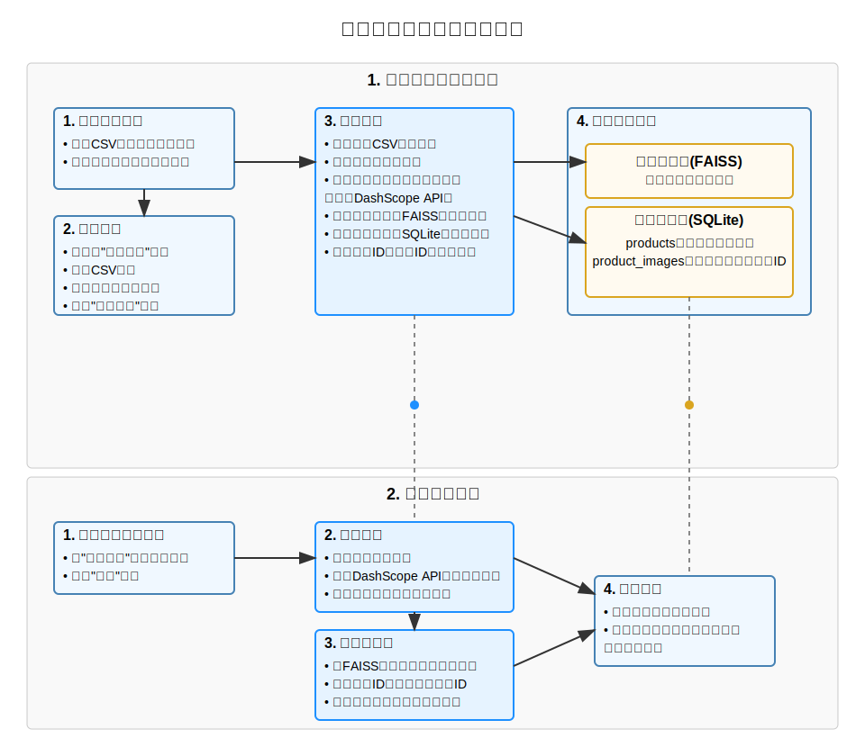
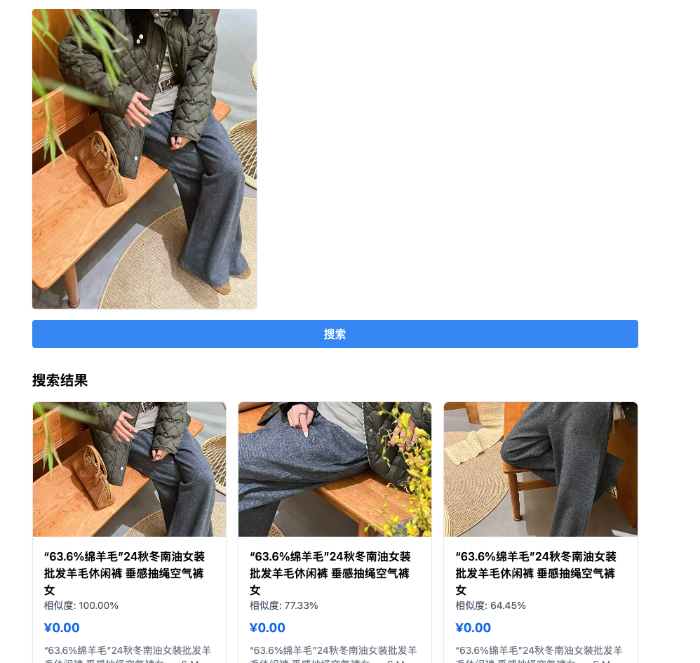
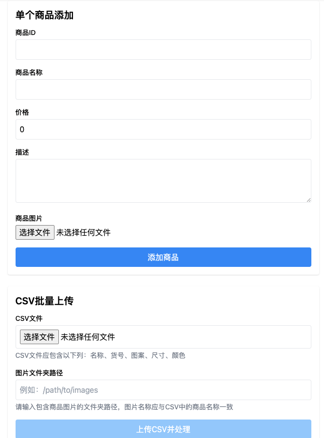

# 商品图像搜索系统 (Product Image Search Engine)

基于人工智能的商品图像搜索系统，支持以图搜图功能。通过DashScope多模态嵌入模型和FAISS向量检索技术，实现高效、精准的商品图像相似度搜索。


项目流程图

## 项目简介

商品图像搜索系统是一个基于人工智能的商品图像搜索系统，支持以图搜图功能。通过DashScope多模态嵌入模型和FAISS向量检索技术，实现高效、精准的商品图像相似度搜索。



## 解决的行业痛点

- 主要针对用户是微商或者做一些跨境电商用户，辅助店家或者业务员快速找到用户询盘的商品吗。
- 数据和图片本地化，保证数据和图片的安全存储和访问。


## 功能特点

- **以图搜图**：上传图片，快速找到相似商品
- **批量导入**：通过CSV和图片文件夹批量导入商品数据
- **高效检索**：毫秒级完成相似图像搜索
- **精准匹配**：基于AI技术的图像特征提取，确保搜索结果准确
- **简单操作**：直观的用户界面，易于使用
- **Docker支持**：提供完整的Docker部署方案

## 工作原理

1. **数据准备与存储**
   - 用户上传CSV文件（包含商品信息）和对应的商品图片
   - 系统为每个商品图片生成特征向量（使用DashScope API）
   - 特征向量存入FAISS向量数据库
   - 商品信息存入SQLite关系数据库

2. **图像搜索流程**
   - 用户上传查询图片
   - 系统提取图片特征向量
   - 在向量数据库中搜索最相似的向量
   - 根据向量ID找到对应的商品信息
   - 展示相似度最高的商品结果

## 技术栈

### 后端
- **语言**: Python 3.9+
- **框架**: Flask
- **数据库**: SQLite
- **AI技术**: 
  - DashScope API (阿里云多模态嵌入模型)
  - FAISS (Facebook AI Similarity Search)
- **核心库**: numpy, faiss-cpu, dashscope, pillow, python-dotenv

### 前端
- **语言**: TypeScript
- **框架**: React 18
- **构建工具**: Vite
- **样式**: Tailwind CSS
- **HTTP客户端**: Axios

## 快速开始

### 环境要求
- Python 3.9+
- Node.js 16+
- DashScope API 密钥

### 后端设置
1. 克隆仓库并进入后端目录：
```bash
git clone https://github.com/yourusername/image-search-engine.git
cd image-search-engine/backend
```

2. 创建并激活虚拟环境（可选但推荐）：
```bash
python -m venv venv
source venv/bin/activate  # Linux/Mac
# 或
venv\Scripts\activate  # Windows
```

3. 安装依赖：
```bash
pip install -r requirements.txt
```

4. 配置环境变量：
```bash
cp .env.example .env
# 编辑.env文件，添加你的DashScope API密钥
```

5. 启动开发服务器：
```bash
python app.py
```

### 前端设置
1. 进入前端目录：
```bash
cd ../frontend
```

2. 安装依赖：
```bash
npm install
```

3. 启动开发服务器：
```bash
npm run dev
```

4. 在浏览器中访问：`http://localhost:5173`

## 使用指南

### 批量导入商品
1. 准备CSV文件，包含以下字段：
   - product_id: 商品ID
   - name: 商品名称
   - price: 价格
   - description: 描述
   - attributes: 属性（JSON格式）
   - image_path: 图片路径

2. 在系统中点击"添加商品"标签
3. 上传CSV文件并指定图片文件夹路径
4. 点击"批量导入"按钮

### 图像搜索
1. 在系统中点击"搜索商品"标签
2. 上传一张商品图片
3. 点击"搜索"按钮
4. 查看相似度最高的商品结果

## 安全注意事项

1. 确保API密钥安全存储在环境变量中
2. 使用HTTPS保护数据传输
3. 定期更新系统和依赖包
4. 设置适当的文件权限
5. 配置rate limiting防止滥用
6. 定期备份数据

## 性能优化

1. 启用Nginx缓存
2. 使用CDN分发静态资源
3. 优化图片存储和传输
4. 配置适当的FAISS索引参数
5. 使用连接池管理数据库连接


## 贡献

欢迎提交问题和拉取请求！

---

*注意：使用本系统需要DashScope API密钥，请在[阿里云官网](https://www.aliyun.com/product/dashscope)申请。*